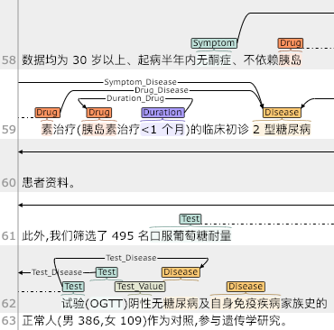
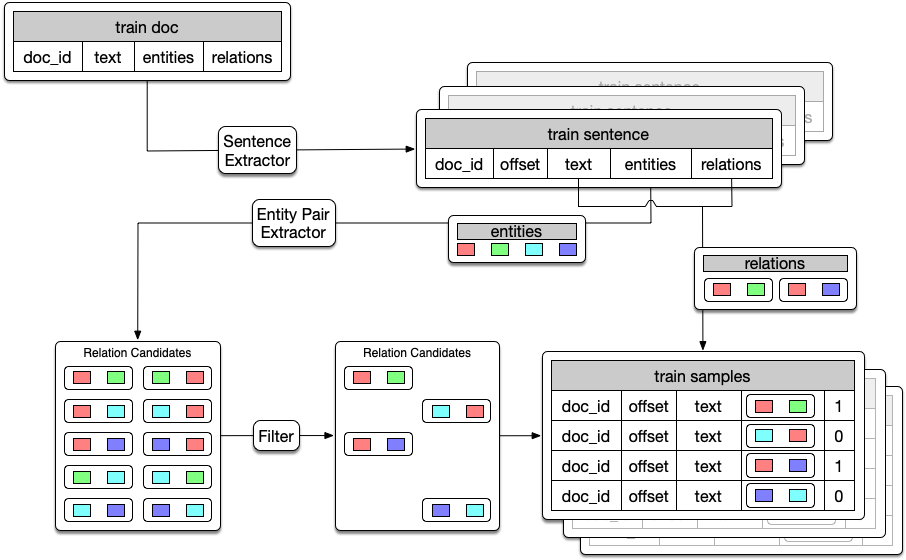
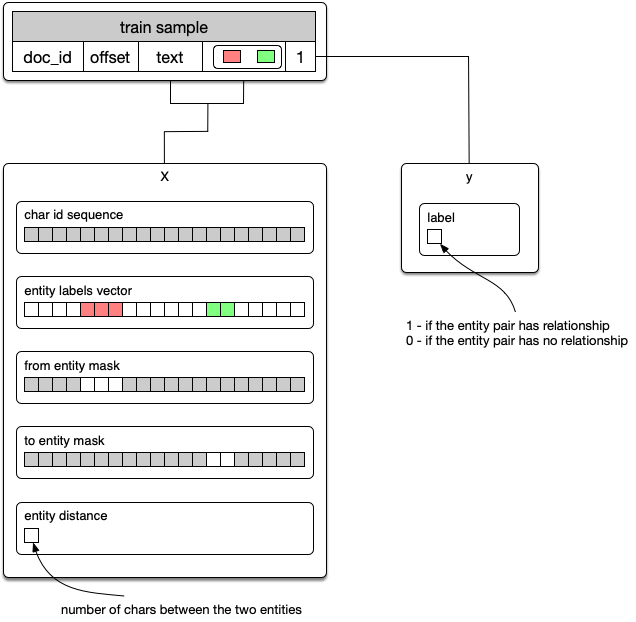
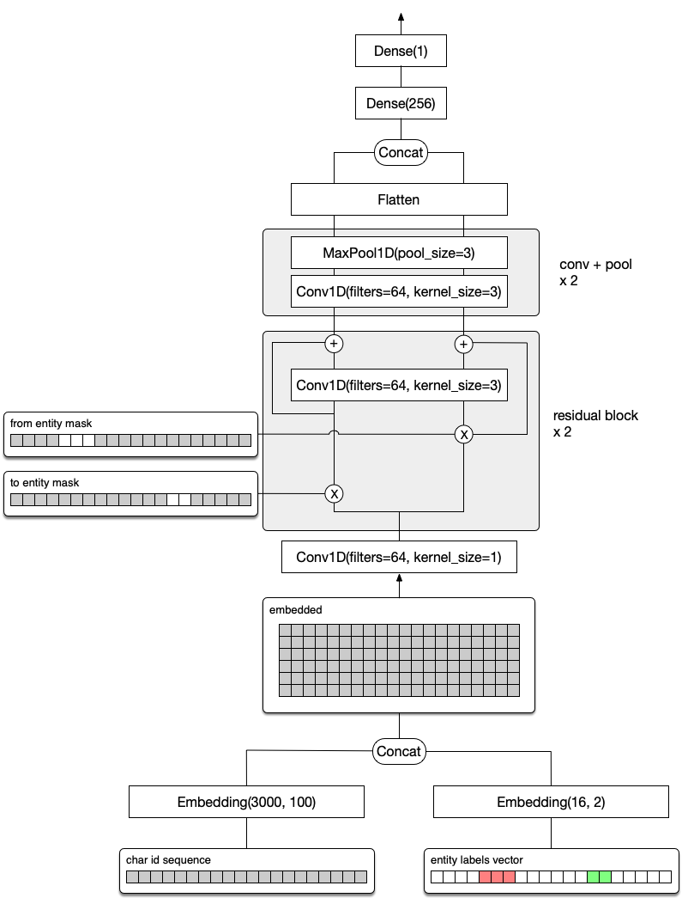

# 瑞金医院MMC人工智能辅助构建知识图谱大赛复赛

[竞赛链接](https://tianchi.aliyun.com/competition/introduction.htm?raceId=231687)

>:warning: 由于可能存在的版权问题，请自行联系大赛主办方索要数据，在 Issues 中索要数据的请求将不再回复，谢谢!

## 背景

复赛题目是在 Named Entity 给定的基础上，做 Relation 抽取。

初赛代码见 [beader/ruijin_round1](https://github.com/beader/ruijin_round1)


实体关系类别名称:

|From Entity Type|To Entity Type|Relation Type|
|:---|:---|:---|
|检查方法|疾病|Test_Disease|
|临床表现|疾病|Symptom_Disease|
|非药治疗|疾病|Treatment_Disease|
|药品名称|疾病|Drug_Disease|
|部位|疾病|Anatomy_Disease|
|用药频率|药品名称|Frequency_Drug|
|持续时间|药品名称|Duration_Drug|
|用药剂量|药品名称|Amount_Drug|
|用药方法|药品名称|Method_Drug|
|不良反应|药品名称|SideEff-Drug|

## 数据样例

`0.txt`

```
中国成人2型糖尿病HBA1C  c控制目标的专家共识
目前,2型糖尿病及其并发症已经成为危害公众
健康的主要疾病之一,控制血糖是延缓糖尿病进展及
其并发症发生的重要措施之一。虽然HBA1C  。是评价血
糖控制水平的公认指标,但应该控制的理想水平即目
标值究竟是多少还存在争议。糖尿病控制与并发症试
验(DCCT,1993)、熊本(Kumamoto,1995)、英国前瞻性
糖尿病研究(UKPDS,1998)等高质量临床研究已经证
实,对新诊断的糖尿病患者或病情较轻的患者进行严
格的血糖控制会延缓糖尿病微血管病变的发生、发展,
```

`0.ann`

```
T1	Disease 1845 1850	1型糖尿病
T2	Disease 1983 1988	1型糖尿病
T4	Disease 30 35	2型糖尿病
T5	Disease 1822 1827	2型糖尿病
...
R206	Symptom_Disease Arg1:T329 Arg2:T325
R207	Symptom_Disease Arg1:T331 Arg2:T325
R208	Test_Disease Arg1:T337 Arg2:T338
R209	Treatment_Disease Arg1:T343 Arg2:T345
R210	Treatment_Disease Arg1:T344 Arg2:T345
```

数据使用 [brat](http://brat.nlplab.org/) 进行标注，每个 .txt 文件对应一个 .ann 标注文件。



## 模型

### 构建训练样本

之前没有做 Relation Extraction 的经验，最直觉的想法是当成一个二分类问题来做。先生成 Candidate Entity Pairs，做一些简单的过滤，然后利用训练集中的 Relation 数据给 Candidate Entity Pairs 打 0 或者 1 的标签。



比赛中，用中文句号 (。) 做句子切分，选取 `size=2`, `step=1` 的滑动窗口来生成句子。即每个句子包含原始文章中的2句话。接着把每个句子中出现的 entities 做个排列组合，把不存在于比赛要求的 10 个 relation type 中的组合过滤掉，作为 candidate entity pairs。

### 向量化



对每个样本进行向量化，提取 5 个向量作为模型的输入。

- `char id sequence` 为转化为字符id后的句子文本序列

- `entity labels vector` 为代表 entity 类别的向量

- `from entity mask` 用 \[1\] 标记出 from_entity 的位置，剩余位置补 \[0\]

- `to entity mask` 用 \[1\] 标记出 to_entity 的位置，剩余位置补 \[0\]

- `entity distance` 为一个带符号的实数，用来表示两个 entity 的距离

### 神经网络结构



## 效果评估

复赛采用 F1-Score 来衡量模型效果。最终这个 baseline model 线上的成绩为 0.733


